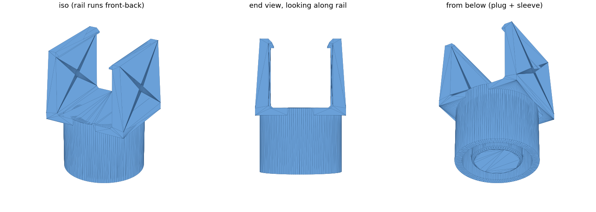

# Bed frame centre-leg adapter

A 3D-printed clip that re-attaches a broken centre leg on a
[Novilla Queen metal platform bed frame](https://www.amazon.com/dp/B0D9LCF4GT)
(model B-F10014, "Classic" style, 14" tall, 1200 lb rated).

The centre legs are 25 mm steel tubes welded under the centre rail. One weld
failed where the leg meets the frame; the leg itself was fine. This part plugs
into the top of the loose leg and snaps onto the rail, so the original steel leg
carries the load again.



## How it works

```
   ┌┐                  ┌┐   ← snap lips hook over the top edges of the rail
   ││    ┌────────┐    ││
   ││    │  rail  │    ││   ← side walls hug the 27 x 27 mm rail;
   │ \   │ 27x27  │   / │     they taper from 5.5 mm at the root to 3.5 mm
   │  \──┴────────┴──/  │   ← 3 mm floor: the rail sits on it
   └──┐ ┌─┐      ┌─┐ ┌──┘
      │ │ │ plug │ │ │      ← plug slides inside the leg (22 mm bore), crush ribs grip it
      │ │ │      │ │ │      ← sleeve goes around the leg, bored to clear the weld seams
      │ │ │      │ │ │
          steel leg
```

The load path is **rail → floor → steel leg rim**. The plastic under the rail is
only ever squeezed, never bent. The plug keeps the leg centred and the sleeve
keeps it upright; neither one carries the bed's weight.

Place it on a plain 27 x 27 mm stretch of the rail, clear of the crossbar and
of the thicker plated section where the leg was originally welded. The lips need
open space above the rail.

## Measurements used

| What | Value | Parameter |
|---|---|---|
| Leg outside diameter | 25 mm | `PEG_OD` |
| Leg inside diameter | 22 mm | `PEG_ID` |
| Leg across the weld seams | 29 mm → 29.8 mm sleeve bore | `SLEEVE_BORE` |
| Rail cross-section | 27 x 27 mm | `RAIL_W`, `RAIL_H` |
| Floor to underside of rail | 12" (305 mm) | leg length; the floor adds 3 mm (`FLOOR`) |

Part size: 38 x 36 x 57 mm, about 30 cm³.

## Files

| File | What |
|---|---|
| `peg-adapter.stl` | The part |
| `peg-adapter-fittest.stl` | Floor plus a 10 mm plug and sleeve only. A quick print to check the fit on the leg |
| `peg_adapter.py` | Parametric generator (FreeCAD). Edit the parameters at the top and re-run |
| `render_preview.py` | Regenerates `preview.png` from the STL |
| `preview.png` | Iso, end and underside views |

## Rebuilding

Needs FreeCAD 1.x (the snap works; it can't read hidden folders, so keep the
repo somewhere like `~/git`).

```bash
freecad.cmd -c "exec(open('peg_adapter.py').read())"
```

```bash
freecad.cmd -c "exec(open('render_preview.py').read())"
```

## Printing

Printed on a Creality CR-10 in PETG, sliced in Cura from the stock CR-10 +
Generic PETG profile.

- **Orientation:** as exported, plug end down, no supports. Skirt, not brim
  (a brim sits on the surfaces that need to fit).
- **Layer height:** 0.2 mm, line width 0.4 mm.
- **Initial Layer Horizontal Expansion: -0.2 mm.** The plug tip and sleeve bore
  both start on the bed, and first-layer squish would make the fit tight.
  Horizontal Expansion and Hole Horizontal Expansion stay at 0; the model
  already includes the clearances.
- **Full part:** 7 walls, 60% infill, 8 top and 8 bottom layers. 7 walls
  (2.8 mm from each face) make the 5.5 mm wall roots solid plastic; the 3 mm
  floor is 15 layers, so 8 + 8 makes it solid too. 100% infill isn't needed and tends to
  make PETG fits tight.
- **Fit test:** 2 walls, 10% infill, 3 top/bottom layers. Fine to print fast.
- **Speed:** 35 mm/s overall, or 45 mm/s with the outer wall at 30 mm/s if your
  Cura shows per-feature speeds. The outer wall sets the fit.
- **PETG:** 240 °C nozzle, 75–80 °C bed, 20–30% fan, 5–6 mm retraction at
  40 mm/s. The hotter nozzle and lower fan bond the layers better, which is
  what the walls rely on. Glue stick on glass.
- **Removing it:** let the bed cool completely, then lever it off by the floor
  plate. Never pull on the side walls: they bend across the layer lines, which
  is the weakest direction.

PETG was chosen over PLA because the snap lips flex when you fit the part and
the floor carries a load full-time. PETG is tougher and creeps less. PLA would
also work.

**Fit test result (v1, plug and sleeve unchanged since):** snug, pushed fully home by hand with the leg rim flat
against the floor. The full part's crush ribs are about 3x longer, so expect to
press harder. Push the leg's foot against the floor or tap it with a mallet.

## Revisions

1. **v1** — 3 mm straight side walls, 1.8 mm lips. Fit the leg and rail well,
   but both walls snapped off at the root while prying the part off the print
   bed: the walls bend across the layer lines, the outer face had no support
   below it, and the sharp inside corner concentrated the stress.
2. **v2** — walls taper from 5.5 mm at the root to 3.5 mm at the lips, with the
   floor plate widened underneath them, a 1 mm chamfer in the inside corner
   (small enough to sit under the rail's rounded corner), and 1.5 mm lips so
   the stiffer walls still flex over the rail. Plug and sleeve unchanged.

## Installing

1. Push the adapter onto the top of the leg until the rim is flat against the
   floor of the adapter.
2. Lift the centre rail slightly (the floor adds 3 mm), stand the leg under a
   plain stretch of rail, and press the rail down between the walls until both
   lips click over it.
3. Optional: drive a sheet-metal screw through the 3.5 mm hole in each wall into
   the rail.

## Tuning

| Symptom | Change |
|---|---|
| Plug too tight / too loose in the leg | `RIB_BITE` down to 0.2 / up to 0.5 |
| Sleeve catches on the welds | `SLEEVE_BORE` up to 30.5 |
| Clip won't snap onto the rail | `WALL_TOP` 3.0, or `LIP` 1.2 |
| Clip pops off too easily | `LIP` 1.8 |
| A lip cracks (more likely in PLA) | `LIP` 1.2 |
| Gap under the rail isn't exactly 12" | adjust `FLOOR` |
| No screw holes wanted | `SCREW_D = 0` |
