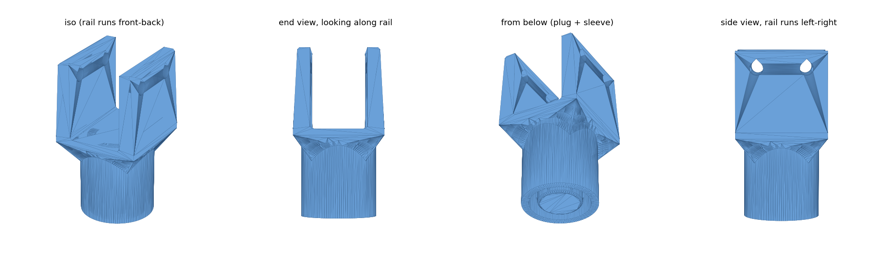

# Bed frame centre-leg adapter

A 3D-printed adapter that re-attaches a broken centre leg on a
[Novilla Queen metal platform bed frame](https://www.amazon.com/dp/B0D9LCF4GT)
(model B-F10014, "Classic" style, 14" tall, 1200 lb rated).

The centre legs are 25 mm steel tubes welded under the centre rail. One weld
failed where the leg meets the frame; the leg itself was fine. This part plugs
into the top of the loose leg and bolts around the rail, so the original steel
leg carries the load again.



## How it works

```
   ┌──────┐  ●══════●  ┌──────┐   ← two M6 bolts across the top, just above the rail
   │      │ ┌──────┐ │      │
   │      │ │ rail │ │      │   ← thick side walls (8 mm at the root, 6 mm at the top)
   │       \│27 x 27│/       │
   └──\─────┴──────┴─────/──┘   ← 3 mm floor: the rail sits on it
       \   ┌─┐      ┌─┐   /      ← 45° skirt so the wide floor prints without supports
        │ │ │ plug │ │ │        ← plug slides inside the leg (22 mm bore), crush ribs grip it
        │ │ │      │ │ │        ← sleeve goes around the leg, bored to clear the weld seams
        │ │ │      │ │ │           40 mm deep
              steel leg
```

The load path is **rail → floor → steel leg rim**. The plastic under the rail is
only ever squeezed, never bent.

The walls and the two bolts form a **closed loop around the rail**. A sideways
push from either direction is shared by both walls and the bolts, and the rail
is clamped between the floor and the bolts, so the adapter can't rock along the
rail either. Nothing on the part is a free-standing arm.

Place it on a plain 27 x 27 mm stretch of the rail, clear of the crossbar and
of the thicker plated section where the leg was originally welded. The bolts
need open space just above the rail.

## Hardware

- 2 × **M6 x 60 mm** bolts (or 1/4"-20 x 2½")
- 2 × M6 nyloc nuts, 4 × M6 washers

The part is 43 mm across, so anything from 55 to 70 mm long works.

## Measurements used

| What | Value | Parameter |
|---|---|---|
| Leg outside diameter | 25 mm | `PEG_OD` |
| Leg inside diameter | 22 mm | `PEG_ID` |
| Leg across the weld seams | 29 mm → 29.8 mm sleeve bore | `SLEEVE_BORE` |
| Rail cross-section | 27 x 27 mm | `RAIL_W`, `RAIL_H` |
| Floor to underside of rail | 12" (305 mm) | leg length; the floor adds 3 mm (`FLOOR`) |

Part size: 43 x 44 x 82 mm, about 61 cm³.

## Files

| File | What |
|---|---|
| `peg-adapter.stl` | The part |
| `peg-adapter-fittest.stl` | Floor plus a 10 mm plug and sleeve only. A quick print to check the fit on the leg |
| `peg_adapter.py` | Parametric generator (FreeCAD). Edit the parameters at the top and re-run |
| `render_preview.py` | Regenerates `preview.png` from the STL |
| `preview.png` | Iso, end, underside and side views |

## Rebuilding

Needs FreeCAD 1.x (the snap works; it can't read hidden folders, so keep the
repo somewhere like `~/git`).

```bash
freecad.cmd -c "exec(open('peg_adapter.py').read())"
```

```bash
freecad.cmd -c "exec(open('render_preview.py').read())"
```

## Printing

Printed on a Creality CR-10 in PETG, sliced in Cura from the stock CR-10 +
Generic PETG profile.

- **Orientation:** as exported, plug end down, no supports. Skirt, not brim
  (a brim sits on the surfaces that need to fit). The bolt holes are teardrop
  shaped so they print cleanly sideways.
- **Layer height:** 0.2 mm, line width 0.4 mm.
- **Initial Layer Horizontal Expansion: -0.2 mm.** The plug tip and sleeve bore
  both start on the bed, and first-layer squish would make the fit tight.
  Horizontal Expansion and Hole Horizontal Expansion stay at 0; the model
  already includes the clearances.
- **Full part:** 8 walls, 60% infill, 8 top and 8 bottom layers. 8 walls
  (3.2 mm from each face) make the side walls almost entirely solid plastic;
  the 3 mm floor is 15 layers, so 8 + 8 makes it solid too. 100% infill isn't
  needed and tends to make PETG fits tight.
- **Fit test:** 2 walls, 10% infill, 3 top/bottom layers. Fine to print fast.
- **Speed:** 35 mm/s overall, or 45 mm/s with the outer wall at 30 mm/s if your
  Cura shows per-feature speeds. The outer wall sets the fit.
- **PETG:** 240 °C nozzle, 75–80 °C bed, 20–30% fan, 5–6 mm retraction at
  40 mm/s. The hotter nozzle and lower fan bond the layers better. Glue stick
  on glass.
- **Removing it:** let the bed cool completely, then lever it off by the floor
  plate, not the walls.

PETG was chosen over PLA because the part sees sideways knocks and carries a
load full-time. PETG is tougher and creeps less.

**Fit test result (plug and sleeve sizes unchanged since v1):** snug, pushed
fully home by hand with the leg rim flat against the floor. The full part's
crush ribs are much longer, so expect to press harder. Push the leg's foot
against the floor or tap it with a mallet.

## Installing

1. Push the adapter onto the top of the leg until the rim is flat against the
   floor of the adapter.
2. Lift the centre rail slightly (the floor adds 3 mm), stand the leg under a
   plain stretch of rail, and slide the cradle up around the rail.
3. Push both bolts through above the rail, with a washer on each side, and
   tighten the nyloc nuts until the bolts sit snug on top of the rail. Don't
   crank them: snug is enough, the job is to close the loop, not to clamp hard.

## Revisions

1. **v1**: 3 mm straight side walls with 1.8 mm snap lips. Fit the leg and rail
   well, but both walls snapped off at the root while prying the part off the
   print bed.
2. **v2**: snap walls tapering from 5.5 mm to 3.5 mm, wider floor, inside-corner
   chamfer, 1.5 mm lips. Survived install, but one arm broke after a while in
   use. The bed sees sideways force, and each arm was a free-standing post
   printed in layers: every push levered it at the root, across the layer
   lines, until it cracked.
3. **v3**: no snap arms. Thick walls (8 mm → 6 mm) tied together over the rail
   by two M6 bolts, so the cradle is a closed loop. Socket deepened from 25 to
   40 mm so a kick on the leg has more plug to lever against. Floor lengthened
   to 44 mm along the rail, with a 45° skirt underneath so it prints without
   supports.

## Tuning

| Symptom | Change |
|---|---|
| Plug too tight / too loose in the leg | `RIB_BITE` down to 0.2 / up to 0.5 |
| Sleeve catches on the welds | `SLEEVE_BORE` up to 30.5 |
| Using bigger bolts (M8 / 5/16") | `BOLT_D` 8.6 |
| Bolts don't reach the rail top / rail is taller | measure it and set `RAIL_H` |
| Gap under the rail isn't exactly 12" | adjust `FLOOR` |
